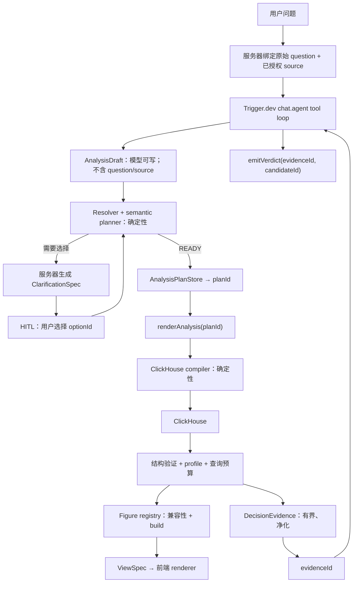

# Architecture V2 — 更多数据与图表，但不扩大模型权限

**状态：设计已决定，尚未实现**  
**日期：2026-07-20**  
**实现计划：**[`IMPLEMENTATION.md`](../IMPLEMENTATION.md) 顶部的 “Architecture V2” 部分

## 1. 一句话

> 模型只把问题翻译成受限的分析意图；可信代码把意图解析成不可篡改的计划，编译
> ClickHouse 查询、选择兼容图表并生成 ViewSpec。

V2 的目标不是 “任何数据、任何图、任何数据库”。目标是：在不增加自由 SQL、动态
JOIN 和任意公式的前提下，让一个新 ClickHouse 分析表和一个新图表都能以小的、可测试的
垂直切片接入。

## 2. 设计目标

1. **更多数据：**支持多个领域的 ClickHouse 单事实关系（表或受治理视图）。
2. **更多图表：**按数据形状扩展，而不是每个图表增加一个 agent tool。
3. **更少幻觉：**模型不能在 plan 与 execution 之间改写字段、计算或范围。
4. **低接入成本：**新数据源不修改 agent、通用 pipeline 或现有 renderer。
5. **低架构成本：**只有一个语义 IR、一个 ClickHouse compiler、一个 tool loop。
6. **可解释：**每张图继续携带计算、范围、限制、版本、SQL 和查询统计。

## 3. 明确不做

- 不让模型写 SQL、SQL fragment、表名、JOIN 或 ViewSpec。
- 不做 “自动连接任何数据库” 的 dialect framework；V2 只承诺 ClickHouse。
- 不让一个问题动态跨多个 source pack JOIN。
- 不做运行时插件加载、YAML 规则引擎或任意公式 AST。
- 不因用户点名一种图就绕过数据角色与可读性规则。
- 不自动把发现到的数值列发布成可信指标；机器只生成草稿，人批准语义。
- 不以 “支持所有图表” 为目标。漏斗、瀑布、Sankey、地图等必须先有真实语义需求。

## 4. 工作负载

- **类型：**mixed OLAP with point-lookups。
- **数据：**追加型事实记录；时间、类别和地理维度；受治理聚合。
- **查询：**过滤后 KPI、趋势、分类比较、分布、关系；少量维度值解析。
- **延迟目标：**warm query 交互级；ClickHouse 只返回小聚合结果。
- **约束：**模型不可信，源数据标签也可能是不可信文本；查询必须有预算。

## 5. V2 不变量

1. **模型唯一可写的分析对象是 `AnalysisDraft`。**其中只有关闭的 enum、用户术语和
   参数值，没有 `question`、`sourceId` 或物理数据库概念。
2. **`AnalysisDraft` 不能直接执行。**确定性 planner 必须先产生 `AnalysisPlan`。
3. **执行只接受 `planId`。**模型不能把 resolved IDs 再抄一遍给执行工具。
4. **当前问题和 source 由服务器绑定。**tool 在 run-local context 中读取原始用户消息和
   已授权 Source Pack；模型不能改写 question 或换 source。
5. **Source Pack 是可信代码。**表、表达式、指标、层级和 resolver 都来自代码审查。
6. **Figure Definition 是可信代码。**模型最多提供 `preferredFigure` hint；registry 决定
   它是否兼容。
7. **LLM 永远看不到 raw rows、数据标签、ViewSpec、SQL 或完整 evidence。**它只看到
   opaque evidence/candidate IDs 与 server-controlled fact kinds。
8. **用户值全部参数化。**Source Pack 中的表达式可以进入 SQL 文本，用户值不可以。
9. **一问一 source。**需要跨源分析时先在 ClickHouse 建受治理的分析关系。
10. **下钻不调用模型。**点击只提交受验证的 semantic action。
11. **最终结论没有自由文本入口。**`emitVerdict` 只能选择服务器从 evidence 构建的 candidate。
12. **只有一个 ViewSpec wire boundary。**客户端继续在 `Tile` 中 `safeParse` 一次。
13. **工具继续声明在 `chat.agent({ tools })`。**保证后续 turn 仍应用 `toModelOutput`。

## 6. 总体架构



扩展只发生在三个地方：

```text
Source Pack registry   决定“有哪些可信数据语义”
AnalysisPlan           决定“这次实际计算什么”
Figure registry        决定“这个结果可以怎样表达”
```

Agent tool surface 不随数据源或图表数量增长。

## 7. 扩展点一：Source Pack

### 7.1 Source Pack 是什么

一个 Source Pack 对应一个可独立分析的 ClickHouse 事实关系。关系可以是原始表、宽表或
受治理视图，但对 agent 来说仍是一张逻辑事实表。

```ts
type SourcePack = {
  model: SemanticModel;
  grain: string; // “每一行代表什么”
  hierarchies?: SemanticHierarchy[];
  queryBudget: {
    maxExecutionSeconds: number;
    maxRowsToRead: number;
    maxBytesToRead: number;
    maxResultRows: number;
  };
  resolvers?: Record<string, ValueResolver>;
};
```

这里只增加当前系统真正需要的三项：事实 grain、可选 hierarchy、每源 query budget。
不增加 dialect、join graph、runtime plugin hooks。

每个可过滤维度还必须在 `SemanticModel` 中声明参数类型和成员策略：

- `snapshot`：稳定、低基数的受治理值域。
- `resolver`：高基数或有歧义的值，查询受治理成员并返回 clarification。
- `parameterized`：不能枚举，但只能作为明确类型的 ClickHouse query parameter。

所有 filter 都经过同一条 member-resolution 路径；即使模型直接说出 `locality` 等真实
dimension ID，也不能绕过歧义检测。`String`、数字、`Date` 和 `DateTime` 的参数类型由
Source Pack 声明，compiler 不再用 “Date，否则 String” 猜测。

### 7.2 目录结构

```text
src/analysis/sources/
  index.ts                         # SOURCES 编译期 registry
  england-wales-house-prices/
    model.ts                       # measures / dimensions / provenance
    values.ts                      # 有界值域 snapshot
    resolver.ts                    # 只有确实需要时才有
    source.test.ts                 # contract + representative queries
    README.md                      # grain、许可、刷新、限制
```

新增 source 时，通用 `tools.ts`、`pipeline.ts`、agent prompt 和 renderer 不应改变；
`sources/index.ts` 只增加一行注册。

### 7.3 单事实关系不等于数据库只有一张表

后台可以有 raw tables、dimensions、dictionaries、materialized views 和 rollups。只是模型
不选择 JOIN 路径。接入者在 ClickHouse 数据层先决定：

- 稳定、常用维度：宽表化或 dictionary。
- 复杂且定期更新的 enrichment：refreshable materialized view。
- 重复的追加型聚合：incremental materialized view。
- 长尾探索问题：raw fact fallback。

### 7.4 Source binding

一个 chat session 绑定一个已授权 Source Pack：

- source picker / route / server action 决定 source，不是模型。
- `onBoot` 验证授权并把 source context 初始化进 `chat.local`。
- `describeData`、`inspectAnalysis`、`explainSemantics` 都读取同一个 bound source。
- 切换 source 建立新 session，或通过受验证的 UI action 显式重置，不让模型暗中切换。
- 跨 source 问题明确拒绝，并建议选择一个 source 或创建组合后的分析关系。

这比让模型 route source 更简单，也避免同名指标在不同 source 间静默串线。

### 7.5 当前需要迁入 Source Pack 的领域泄漏

- `place-resolver.ts` 的 locality/county/district SQL。
- 房价 percentile aggregation menu 与 system prompt 中的房价解释。
- `GeoLevel` 地理层级。
- dimension snapshot 脚本的表名、字段和输出路径。
- 全局 `CLICKHOUSE_DATABASE` 覆盖；每个 pack 必须拥有自己的可信 relation，环境变量只能
  显式覆盖当前 bound pack。

`SourceAdapter` 也应改名为 `QueryExecutor`：它当前只负责执行，SQL 始终由
`compileClickHouseQuery` 生成。不要把测试注入缝宣传成多数据库适配层。

## 8. 扩展点二：不可篡改的 AnalysisPlan

### 8.1 当前残留风险

当前 `inspectAnalysis` 返回 resolved IDs 后，模型还需把它们复制进
`renderAnalysis`。即使第二次会再次规划，模型仍可能丢掉 filter、改变 grain 或误抄
measure。更严重的是 `question` 也由模型填写；它可以删掉 “average/latest” 等词，绕过
依赖原问题的确定性 guard。V2 同时移除这两个通道。

`run()` 在调用 `streamText` 前，从 messages 取最后一条真实 user message，写入 run-local
context。`inspectAnalysis` 的 tool schema 不再包含 `question` 或 `sourceId`，execute 时由
服务器组合：

```ts
planAnalysis({
  ...modelDraft,
  question: currentTurn.originalUserText,
  sourceId: boundSource.id,
});
```

通用 agent schema 中也删除房价专属 `{ field: "price", aggregation: "p90" }` 组合语法。
模型只传用户的 measure 术语；Source Pack 注册哪些聚合是可信指标以及对应 synonyms。

### 8.2 Intent grounding

模型提交的是用户术语，不是“已确认”的 governed ID。planner 对每个非默认的 measure、
dimension、filter、threshold、top-N 和 time range 都要求以下证据之一：

1. 能定位到 canonical question 中的原文 span，并通过 Source Pack synonym/value policy
   确定性解析；或
2. 来自本 run 中一个已验证的 clarification option。

只有问题完全未提某类概念时，planner 才能应用 Source Pack 的明确 default。删除类似
`measuresAreVerbatimIds` 的模型自证字段；模型直接提交 `median_price` 不代表用户确认过。
`limit`、series selection 和 comparison 也由用户原文或固定 policy 推导，不能因为模型填了
一个合法数字就获得执行权限。

### 8.3 PlanStore

`inspectAnalysis` 产生 READY 时：

```ts
type ReadyPlanEnvelope = {
  status: "ready";
  planId: string;
  summary: string;
};
```

完整 `AnalysisPlan` 存入用 `onBoot` 初始化的 `chat.local<AnalysisState>`；
`renderAnalysis` 的 schema 变为：

```ts
z.object({ planId: z.string() })
```

- 未知、过期或属于另一 run 的 ID：不查询，返回 `PLAN_EXPIRED`，要求重新 inspect。
- V2 第一版每个 turn 只允许一个 active plan 和一次 query；类别比较应由一次聚合查询完成。
- 若未来确实需要多份证据，新增受限 `QueryBundle`（最多 2–3 个 server-approved plans），
  不重新开放模型自由查询 loop。
- V2 第一版不增加数据库 plan store。只有真实 continuation 丢失率证明需要时再持久化。

`chat.local` 是 run-scoped、跨 turn 的版本精确原语；必须在 `onBoot` 初始化。fresh
continuation run 会得到空 store，因此 “重新 inspect” 是显式、可恢复的降级。

### 8.4 Clarification 不再由模型复述选项

Planner 生成：

```ts
type ClarificationEnvelope = {
  status: "needs_clarification";
  clarificationId: string;
  spec: DisambiguationSpec; // 服务器生成，给前端
};
```

- `toModelOutput` 只告诉模型 `clarificationId`。
- 无 `execute` 的 `requestClarification` 只接受该 ID，不接受 question/options 文本。
- 前端从同一条 `inspectAnalysis` tool output 读取并渲染服务器生成的 spec。
- 用户只返回 `optionId`。
- 下一次 inspect 使用 `{ clarificationId, optionId }` 恢复受治理 draft。
- 模型捏造 ID 时，前端没有可信 spec 可渲染；绝不展示模型编造的选项。
- `hydrateMessages` 将浏览器返回的 option 与 pending toolCallId、run-local clarification 和
  source 对照；重复提交按 toolCallId 幂等，跨 run/replay 拒绝。
- resolver timeout/连接错误返回 `RESOLVER_UNAVAILABLE`，不能伪装成 “没有这个值”。

## 9. 扩展点三：Figure Definition registry

### 9.1 两个 registry 是正确边界

服务器不能 import React，因此保留两个穷尽 registry：

```text
FIGURES    server：compatible / finalize / build / evidence
RENDERERS  client：ViewSpec → React tile
```

不要为了 “一个 registry” 把 React 拉进 Trigger.dev worker。

### 9.2 Figure Definition

```ts
type FigureDefinition<K extends FigureKind> = {
  kind: K;
  compatible(plan: AnalysisPlan, model: SemanticModel): Compatibility;
  finalize(profile: DatasetProfile): FinalFigureDecision;
  build(context: FigureBuildContext): Extract<ViewSpec, { kind: K }>;
  evidence(spec: Extract<ViewSpec, { kind: K }>): DecisionEvidence;
};
```

- `chart-policy.ts` 只保留跨图的候选排序。
- 每种图自己拥有硬数据角色规则、post-query 上限、spec builder 和 evidence summarizer。
- `pipeline.ts` 不再有 `buildSpec` switch，改为 `FIGURES[kind].build(...)`。
- `preferredFigure` 继续是关闭 enum；unknown chart 在 planning 阶段拒绝，不降级成字符串。

### 9.3 按数据形状扩图，不按图表目录扩图

优先顺序：

1. **grouped column：**时间 × 类别 × 一个度量；验证 registry 的第一个新图。
2. **heatmap：**两个有界维度 × 一个度量；解决多分类比较。
3. **small multiples：**多个系列超过一张线图可读上限时的布局选择。
4. **map：**只有 Source Pack 提供稳定 geo code / geometry capability 时才开放。

继续延期：

- Funnel：需要有序阶段和合法分母语义。
- Waterfall：需要受治理的加减分解语义。
- Sankey：需要 source/target/weight 关系事实。
- Gantt：需要 interval 与 entity 语义。

这些不是 “缺 renderer”，而是缺分析语义；在真实 source 需要前不建抽象。

## 10. DecisionEvidence 与确定性 verdict

Figure Definition 从实际 ViewSpec 构建一份只保存在服务器的有界证据：

```ts
type DecisionEvidence = {
  evidenceId: string;
  figureKind: FigureKind;
  scope: string[];
  facts: Array<{
    factId: string;
    kind: "value" | "rank" | "change" | "difference" | "coverage";
    subject: string;
    metric: string;
    value: number;
    time?: string;
  }>;
  omitted: string[];
};
```

规则：

- server-side evidence ledger 最大 4KB；超过预算只保留决定性 aggregate facts。
- label 去控制字符、换行并限制长度。
- 自由文本维度默认不能形成 insight candidate；Source Pack 必须显式标注用途。
- table preview、category labels、事实数值都不送回模型。
- Figure Definition 根据 fact kind 和图表语义生成有限的 `InsightCandidate`；例如
  `rank_first`、`change_over_period`。candidate 绑定 template、fact IDs 和完整 VerdictSpec。
- `toModelOutput` 只返回 evidenceId、candidateId 与 server-controlled kind，例如
  `FIGURE_RENDERED evidence=e1 candidates=c1:rank_first,c2:coverage`。
- `emitVerdict` 只接受 `{ evidenceId, candidateId }`，不再接受 headline、detail、数字或实体名。
- server 校验 candidate 属于当前 run/source/evidence 后，直接返回预先构建的 VerdictSpec。
- 没有合法 candidate 时返回中性 notice，不尝试让模型 “写一版”。
- 因果、预测和数据未证明的比较没有 template，因此不存在输出通道。

这样不仅机械阻止伪造数字，也阻止模型自由撰写因果或范围陈述。图始终是权威答案，
verdict 只是由同一份证据确定性生成的 garnish。

## 11. Tool loop 仍然是一个 loop，但增加机械状态门

不改成 prompt chain。继续使用一个 `streamText` 和 `stepCountIs`，但在保留
`chat.toStreamTextOptions().prepareStep` 的前提下，根据当前状态限制 `activeTools`：

| 状态 | 允许的下一步 |
|---|---|
| 新问题 | inspect / describe / explain / emitNotice(reason enum) |
| READY(planId) | render(planId) |
| NEEDS_CLARIFICATION | requestClarification(clarificationId) |
| 已渲染 evidence | emitVerdict(evidenceId, candidateId) |
| 最后一步 | 有 evidence 时强制 emitVerdict，否则 emitNotice |

每一步设置 `toolChoice: "required"`，防止模型首步直接输出 prose 后令 AI SDK 提前结束；
`stopWhen` 使用 `[hasToolCall("emitVerdict"), hasToolCall("emitNotice"),
stepCountIs(STEP_BUDGET)]`。`emitNotice` 只接受关闭的 reason code，并由服务器构造中性
VerdictSpec。因为 required 保证每一步都有 tool result，stop conditions 才会稳定被评估。

Prompt 负责建议；`toolChoice`、`activeTools`、tool schema、PlanStore 和 registry 负责边界。

## 12. 通用下钻

删除 housing-specific `GeoLevel`，改为受治理 semantic action：

```ts
type DrillAction = {
  type: "drill";
  sourceId: string;
  dimensionId: string;
  value: string;
  nextDimensionId?: string;
  scope: AnalysisFilter[];
};
```

- ViewSpec 由可信 builder 生成 action。
- `actionSchema` 只验证结构；`onAction` 再针对 Source Pack hierarchy、value domain 和当前
  source authorization 验证语义。
- action 中永远没有 SQL 或表达式。
- 有 pending HITL tool 时拒绝 drill，避免两个控制流竞争。
- `onAction` 重新 plan → query → build → stream，完全不调用 LLM。

第一版可以携带并重新验证 resolved scope；私有/多租户 source 出现时再给 action 签名，
不要现在引入 token service。

## 13. 防幻觉边界表

| 风险 | 模型可以提交 | 可信代码强制 | 失败行为 |
|---|---|---|---|
| 越权或虚构 source | 无对应字段 | session 只绑定一个已授权 registry entry | 拒绝 session / 显式重选 source |
| 改写用户问题 | 无对应字段 | schema 中删除；服务器注入原始 user message | 不存在通道 |
| 虚构 measure/dimension | 用户术语 | semantic ID、synonym、值域解析 | clarify / unsupported |
| 修改已批准计划 | planId | PlanStore lookup | PLAN_EXPIRED，不查询 |
| 写 SQL/JOIN | 无对应字段 | 单一 ClickHouse compiler | 不存在通道 |
| 自由公式 | closed comparison enum | compiler registry | unsupported |
| 误选图表 | preferred enum | Figure compatible/finalize | 替代图或 notice |
| 数据形状不合法 | 无 | required columns、numeric、grain uniqueness | validation notice |
| 编造 clarification | clarificationId | UI 只渲染 server spec | 不显示无效 ID |
| 数据标签 prompt injection | 无 | labels/table preview 不进入 model prompt | 不存在通道 |
| verdict 编数字/因果 | evidenceId + candidateId | server-built candidate；无自由文本字段 | neutral notice |
| 首步 prose / 提前停 | text generation | 每步 toolChoice required + hasToolCall stop | 不存在 prose channel |
| UI 版本漂移 | 无 | 单一 ViewSpec.safeParse | BrokenTile |

## 14. ClickHouse 数据层决策

### 保留 raw fact + 按证据增加 rollup

- 长尾、临时分析继续查 raw fact。**Category: derived；confidence: high。**
- 真实查询日志证明重复的追加型聚合后，才增加 incremental MV。**Category: official；
  confidence: high。**
- raw fallback 永远保留，避免每加一个问题就加一张聚合表。

来源：[`query-mv-incremental`](https://clickhouse.com/docs/materialized-view/incremental-materialized-view)。

### enrichment 不交给模型

- 小而慢变、反复 key lookup 的维度使用 dictionary。**Category: official；confidence: high。**
- 稳定维度且复制成本可接受时宽表化。**Category: derived；confidence: high。**
- 复杂 join、定期重算时使用 refreshable MV。**Category: official；confidence: high。**

来源：[Dictionaries](https://clickhouse.com/docs/en/sql-reference/dictionaries)、
[minimize joins](https://clickhouse.com/docs/best-practices/minimize-optimize-joins)、
[refreshable MV](https://clickhouse.com/docs/materialized-view/refreshable-materialized-view)。

### 每个 Source Pack 自带性能证明

- onboarding 先发现 schema、sort key、skip indexes、sample values，再写 model。
  **Category: official；confidence: high。**
- representative query 必须 `EXPLAIN indexes = 1`，证明常用 filter 对齐 ORDER BY。
  **Category: official；confidence: high。**
- 每次查询同时有 result、scan bytes/rows 和 wall-time limits；生产用 read-only settings
  profile 与 quota 再兜底。**Category: official；confidence: high。**

来源：`agent-discovery-schema`、`schema-pk-filter-on-orderby`、`agent-query-safety`，以及
[query complexity](https://clickhouse.com/docs/operations/settings/query-complexity)。

### ingestion 由 source 决定，不做统一管线

- 能批量时 direct insert 10K–100K rows。**Category: official；confidence: high。**
- 只能产生高频小批时 async insert。**Category: official；confidence: high。**
- 只有多 producer、burst、replay 需求真实存在时才引入 Kafka。**Category: derived/field；
  confidence: workload-dependent。**

来源：[selecting an insert strategy](https://clickhouse.com/docs/best-practices/selecting-an-insert-strategy)、
[asynchronous inserts](https://clickhouse.com/docs/optimize/asynchronous-inserts)。

## 15. 复杂度预算

V2 允许：

- 1 个 ClickHouse compiler
- 1 个受治理 semantic request/plan IR
- 1 个编译期 Source Pack registry
- 1 个 server Figure registry + 1 个 client Renderer registry
- 1 个 Trigger.dev tool loop
- 每次 analysis 1 个 source

以下任何一个出现都需要新的 ADR，而不是顺手加入：

- 第二种数据库 dialect
- runtime plugin loader
- dynamic join planner
- arbitrary calculated-field DSL
- cross-source query planner
- vector/LLM value resolution in the online query path

## 16. V2 架构验收

架构只有同时通过以下测试才算成立：

1. 模型提交不存在的 planId 时，ClickHouse client 调用次数为 0。
2. 模型尝试在 inspect 后改变 filter/measure 时，没有对应输入通道。
3. 无效 clarificationId/optionId 不产生 query，也不显示模型编写的选项。
4. 新增 grouped-column 不修改 agent tools。
5. 新增第二个真实 Source Pack 不修改 agent、pipeline 或任何现有 figure definition。
6. 新 source 的至少 12 个 golden questions 产生预期 resolved plan。
7. 每个 source 至少有一个 credential-gated live integration test。
8. adversarial 测试覆盖 raw SQL 请求、未知指标、未知图、恶意 label 和伪造 verdict 数字。
9. turn 2/3 prompt 中仍无 ViewSpec、raw rows 或 SQL。
10. 所有图继续有 rows/bytes scanned、query time 和 explanation manifest。

## 17. 开源产品形态

先以一个 repo 发布三层，不急着拆 npm packages：

```text
reference app       UK house-price 可运行示例
governed core       planner / compiler / figure registry / agent loop
source-pack kit     template / contract tests / inspect-init-doctor workflow
```

对使用者的实际价值不是 “AI 帮你随便查库”，而是：

- 数据团队能把已经批准的指标和维度变成自然语言 + 图表入口，而不开放自由 SQL。
- 应用团队能加一张图而不改 agent reasoning；漏注册会在编译或 contract test 时失败。
- 公共数据维护者能随图公开来源、刷新时间、限制和查询成本，让结论可追溯。
- 贡献者有一个小而明确的单元：Source Pack 或 Figure Definition，不必理解整个 agent。

发布前提供 MIT license、可公开 demo data/加载说明、15 分钟 quickstart、Source Pack
模板、第二 source 示例、无凭证的 stub test，以及 opt-in live test。README 必须诚实写
“governed ClickHouse single-fact sources”，不能写 “connect any data”。只有出现第二个真实
consumer 后，才评估是否拆 `core` package；此前 monorepo 边界更容易理解和维护。
